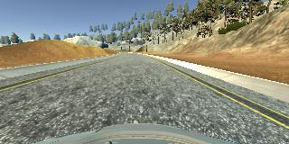
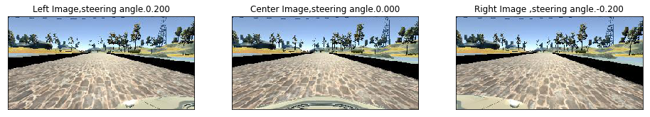
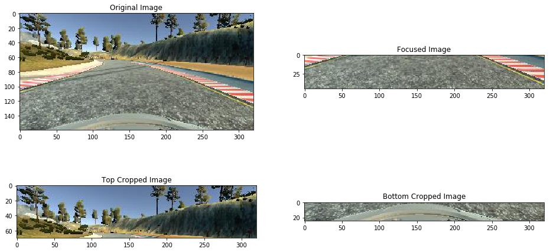
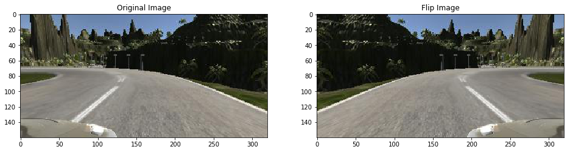
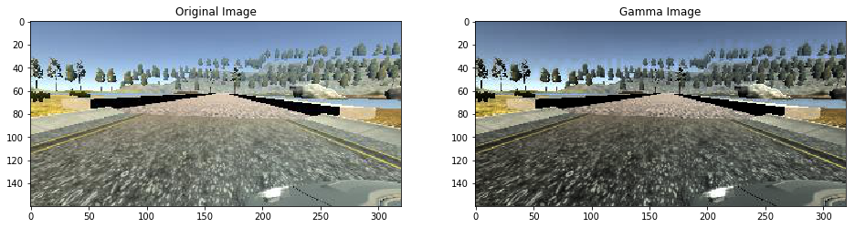
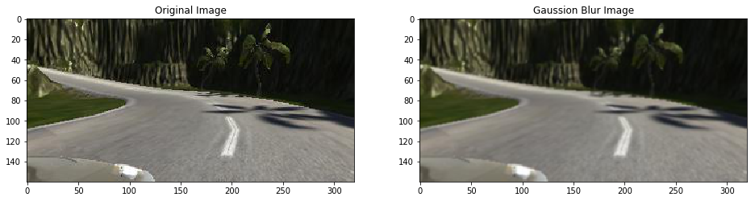
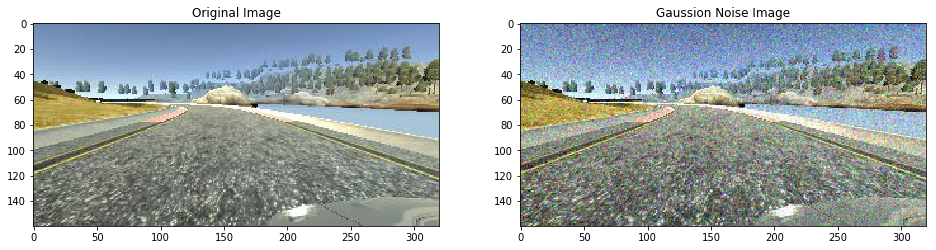
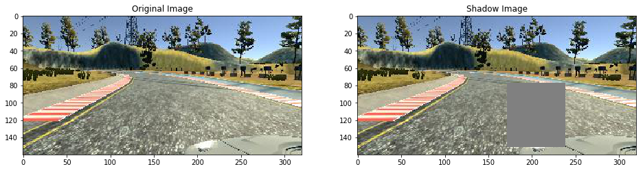
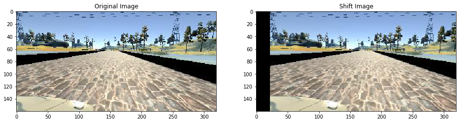
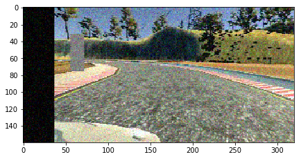

# **Behavioral Cloning** 

## Writeup Template

### You can use this file as a template for your writeup if you want to submit it as a markdown file, but feel free to use some other method and submit a pdf if you prefer.

---

**Behavioral Cloning Project**

The goals / steps of this project are the following:
* Use the simulator to collect data of good driving behavior
* Build, a convolution neural network in Keras that predicts steering angles from images
* Train and validate the model with a training and validation set
* Test that the model successfully drives around track one without leaving the road
* Summarize the results with a written report    

## Rubric Points
### Here I will consider the [rubric points](https://review.udacity.com/#!/rubrics/432/view) individually and describe how I addressed each point in my implementation.  

---
### Files Submitted & Code Quality

#### 1. Submission includes all required files and can be used to run the simulator in autonomous mode

My project includes the following files:
* model.py containing the script to create and train the model
* drive.py for driving the car in autonomous mode
* model.h5 containing a trained convolution neural network 
* writeup_report.md or writeup_report.pdf summarizing the results

#### 2. Submission includes functional code
Using the Udacity provided simulator and my drive.py file, the car can be driven autonomously around the track by executing 
```sh
python drive.py model.h5
```

#### 3. Submission code is usable and readable

The model.py file contains the code for training and saving the convolution neural network. The file shows the pipeline I used for training and validating the model, and it contains comments to explain how the code works.

### Model Architecture and Training Strategy

#### 1. An appropriate model architecture has been employed

My model consists of a convolution neural network with 5x5 and 3x3 filter sizes and depths between 24 and 64 (model.py lines 304-308)   

The model includes RELU layers to introduce nonlinearity (code line 304-308), and the data is normalized in the model using a Keras lambda layer (code line 302).   

#### 2. Attempts to reduce overfitting in the model

The model contains dropout layers in order to reduce overfitting (model.py lines 309, 312, 314, 316). 

The model was trained and validated on different data sets to ensure that the model was not overfitting (code line 328). The model was tested by running it through the simulator and ensuring that the vehicle could stay on the track.

#### 3. Model parameter tuning

The model used an adam optimizer, so the learning rate was not tuned manually (model.py line 324).

#### 4. Appropriate training data

Training data was chosen to keep the vehicle driving on the road. I used a combination of center lane driving, recovering from the left and right sides of the road with correction 0.2   

For details about how I created the training data, see the next section. 

### Model Architecture and Training Strategy

#### 1. Solution Design Approach

My first step was to use a convolution neural network model similar to the ... I thought this model might be appropriate because ...

In order to gauge how well the model was working, I split my image and steering angle data into a training and validation set. I found that my first model had a low mean squared error on the training set but a high mean squared error on the validation set. This implied that the model was overfitting. 

To combat the overfitting, I modified the model so that ...

Then I ... 

The final step was to run the simulator to see how well the car was driving around track one. There were a few spots where the vehicle fell off the track... to improve the driving behavior in these cases, I ....

At the end of the process, the vehicle is able to drive autonomously around the track without leaving the road.

#### 2. Final Model Architecture

The final model architecture (model.py lines 303-318) consisted of convolution neural network,  dropout layers and fully connected layers.   

My final model consisted of the following layers:    

    Layer (type)                 Output Shape              Param #   
    =================================================================
    input_1 (InputLayer)         (None, 160, 320, 3)       0         
    _________________________________________________________________
    lambda_1 (Lambda)            (None, 160, 320, 3)       0         
    _________________________________________________________________
    cropping2d_1 (Cropping2D)    (None, 65, 320, 3)        0         
    _________________________________________________________________
    conv2d_1 (Conv2D)            (None, 31, 158, 24)       1824      
    _________________________________________________________________
    conv2d_2 (Conv2D)            (None, 14, 77, 36)        21636     
    _________________________________________________________________
    conv2d_3 (Conv2D)            (None, 5, 37, 48)         43248     
    _________________________________________________________________
    conv2d_4 (Conv2D)            (None, 3, 35, 64)         27712     
    _________________________________________________________________
    conv2d_5 (Conv2D)            (None, 1, 33, 64)         36928     
    _________________________________________________________________
    dropout_1 (Dropout)          (None, 1, 33, 64)         0         
    _________________________________________________________________
    flatten_1 (Flatten)          (None, 2112)              0         
    _________________________________________________________________
    dense_1 (Dense)              (None, 100)               211300    
    _________________________________________________________________
    dropout_2 (Dropout)          (None, 100)               0         
    _________________________________________________________________
    dense_2 (Dense)              (None, 50)                5050      
    _________________________________________________________________
    dropout_3 (Dropout)          (None, 50)                0         
    _________________________________________________________________
    dense_3 (Dense)              (None, 10)                510       
    _________________________________________________________________
    dropout_4 (Dropout)          (None, 10)                0         
    _________________________________________________________________
    dense_4 (Dense)              (None, 1)                 11        
    =================================================================
    Total params: 348,219
    Trainable params: 348,219
    Non-trainable params: 0
    _________________________________________________________________

#### 3. Creation of the Training Set & Training Process

To capture good driving behavior, I first recorded two laps on track one using center lane driving. Here is an example image of center lane driving:



I then combine left and right images to center images with correction angle 0.2.    



Not all of these pixels contain useful information, however. In the image, the top portion of the image captures trees and hills and sky, and the bottom portion of the image captures the hood of the car. The model might train faster if crop each image to focus on only the portion of the image that is useful for predicting a steering angle. So, I remove 70 top rows pixels and 25 bottom pixels.   

**Croped image**


To augment the data set, I also defined all kinds of functions. Below are examples of these methods：    

**The fliped image**:    


**The gamma correction image**:    


**The Gaussion Blur image**:    


**The Gaussion Noise image**


**Added shadow image**


**The shifted image**


**Combine all above methods image**   


After the collection process, I had 41910 number of data points. I then preprocessed this data by normalize to [-0.5,0.5]. This process will made the model fastly convergence.   


I finally randomly shuffled the data set and put 20% of the data into a validation set. 

I used this training data for training the model. The validation set helped determine if the model was over or under fitting. I used earlystop method to choose epochs. I used an adam optimizer so that manually training the learning rate wasn't necessary.


#### Automatic Drive model


